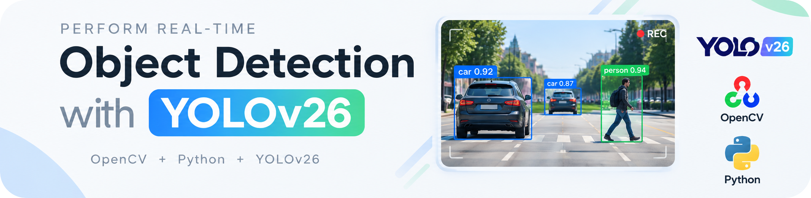
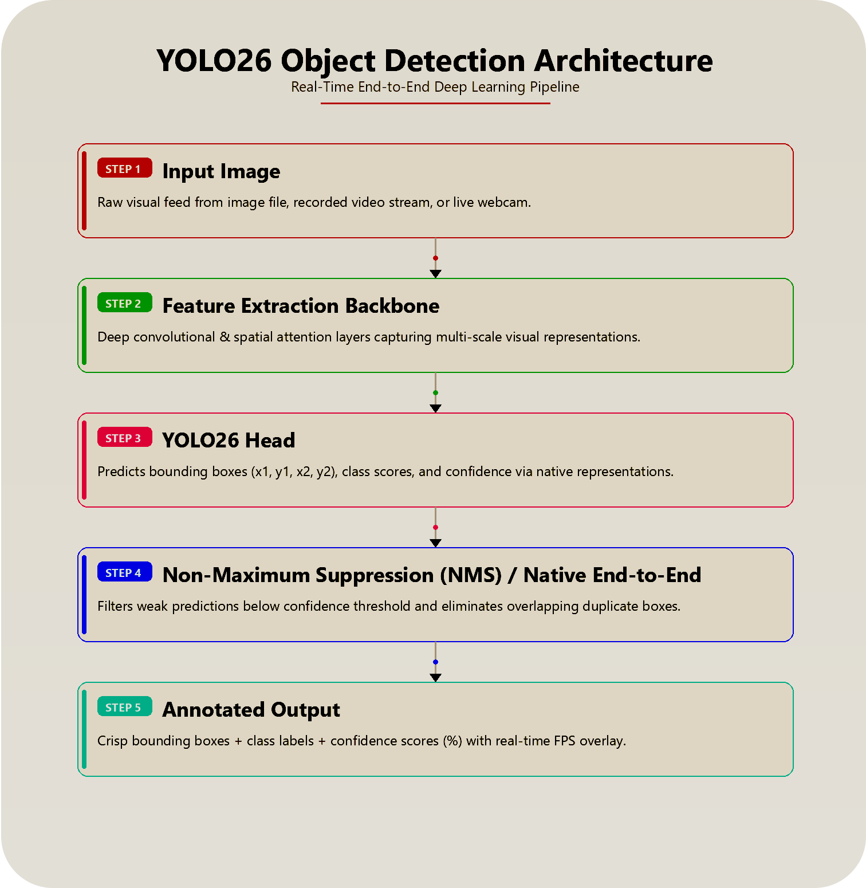
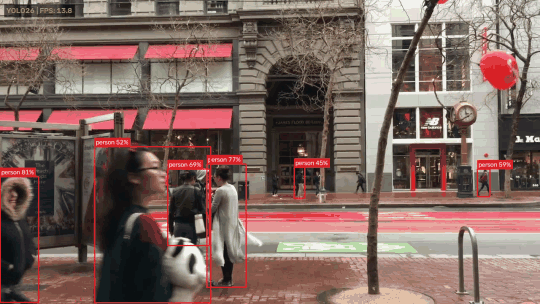
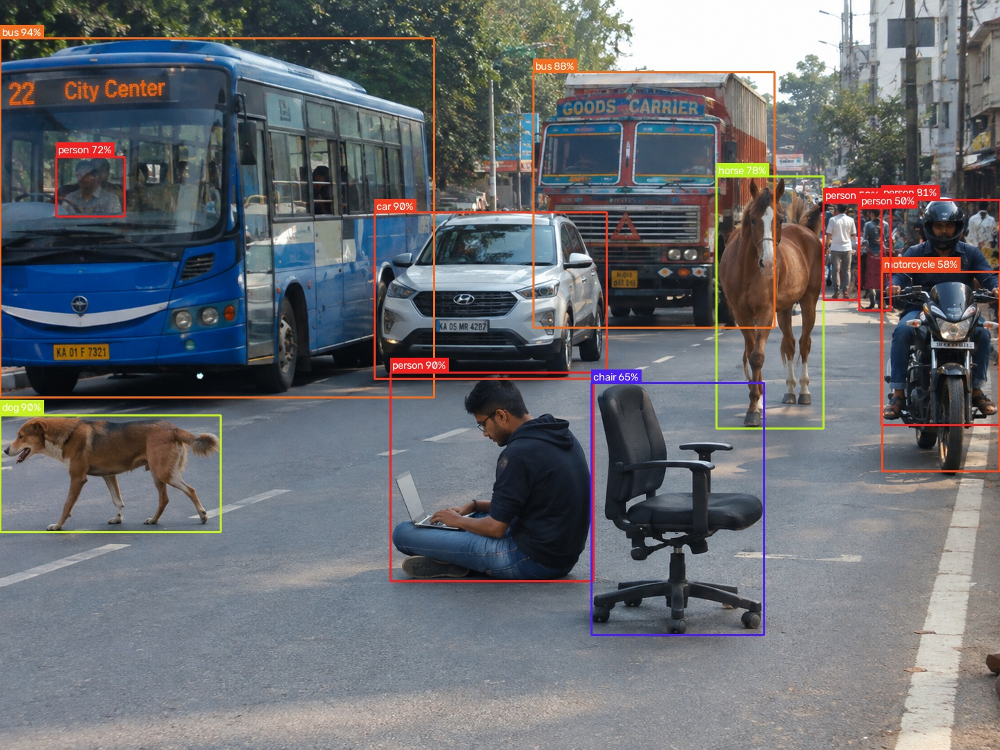
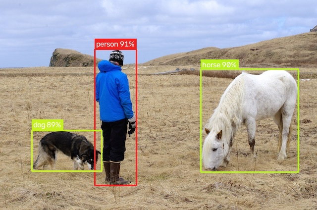
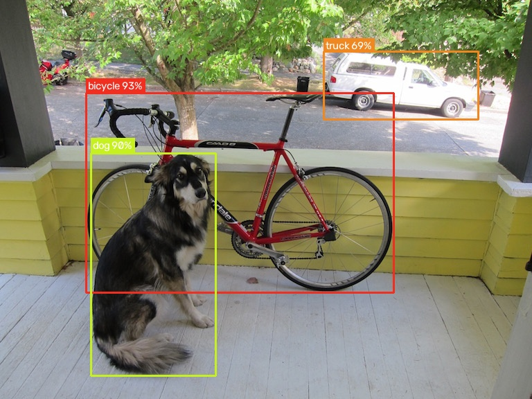

<div align="center">

# 🚀 Real-Time Object Detection with YOLO26

<p align="center">
  <strong>A high-throughput, pedagogical computer vision pipeline for real-time object detection across video streams, static imagery, and live camera feeds using Ultralytics YOLO26 & OpenCV.</strong>
</p>

[](https://www.python.org/)
[](https://pytorch.org/)
[](https://opencv.org/)
[](https://github.com/ultralytics/ultralytics)
[](LICENSE)

<br/>



</div>

---

## 📖 Table of Contents

- [Overview](#-overview)
- [Key Features](#-key-features)
- [Pipeline Architecture](#-pipeline-architecture)
- [Visual Showcase & Benchmarks](#-visual-showcase--benchmarks)
- [Repository Structure](#-repository-structure)
- [Installation & Setup](#-installation--setup)
- [Quickstart Guide](#-quickstart-guide)
  - [1. Detect Objects in a Video File](#1-detect-objects-in-a-video-file)
  - [2. Detect Objects in a Static Image](#2-detect-objects-in-a-static-image)
  - [3. Live Webcam Stream](#3-real-time-live-webcam-stream)
  - [4. Frame Limit for Rapid Testing](#4-quick-testing-on-long-videos-frame-limit)
  - [5. Fine-Tuning Confidence & IoU](#5-custom-confidence-and-iou-thresholds)
- [Keyboard Controls](#-keyboard-controls)
- [CLI Reference](#-cli-reference)
- [Model Zoo & Benchmarks](#-model-zoo--benchmarks)
- [COCO 80-Class Taxonomy](#-coco-80-class-taxonomy)
- [Core Concepts Explained](#-core-concepts-explained)
- [Troubleshooting & FAQs](#-troubleshooting--faqs)
- [Contributing & License](#-contributing--license)

---

## 🌟 Overview

**Real-Time Object Detection with YOLO26** delivers an end-to-end, production-grade implementation of modern real-time visual perception. Built with Python, **OpenCV**, and the **Ultralytics YOLO26** architecture, this repository demonstrates how to bridge raw video decoders with deep convolutional and attention-based neural backbones.

### Why This Project?
- **Designed for Learners and Practitioners**: Cleanly structured, typed, and documented code that unpacks the mechanics of object detection step-by-step.
- **Production Foundations**: Includes moving-average FPS smoothing, HSV color separation, collision-safe label rendering, and configurable headless vs. GUI execution.
- **Cross-Platform & Flexible**: Ready to run on Windows, macOS, and Linux using either standard `pip` or blazing-fast `uv`.

---

## ✨ Key Features

- ⚡ **Real-Time Throughput**: Achieves ~35+ FPS on commodity CPU hardware with YOLO26 Nano (`yolo26n.pt`), scaling to 120+ FPS on CUDA-enabled GPUs.
- 🎥 **Multi-Source Ingestion**: Unified engine accepts video files (`.mp4`, `.avi`, `.mov`), images (`.jpg`, `.png`, `.webp`), and live hardware cameras (`device 0`, `1`, etc.).
- 📊 **Dynamic HUD Telemetry**: Integrated rolling FPS counter with moving-average temporal smoothing and active model branding.
- 🎨 **HSV-Harmonized Class Palette**: Programmatically distributed hue spectrum ensuring visually distinct, vibrant bounding boxes across all 80 COCO classes.
- 🏷️ **Adaptive Label Badges**: Boundary-clamped label badges displaying class names and confidence percentages without clipping frame borders.
- 🔄 **Smart Extension Auto-Resolution**: Intelligently searches for equivalent image extensions (`.png` ↔ `.jpg` ↔ `.webp`) if an exact file match is omitted.
- ⚙️ **Dual Execution Modes**: Interactive GUI preview window (`--show`) with keyboard interrupt controls (<kbd>q</kbd>), or high-throughput headless batch processing.

---

## 🏗️ Pipeline Architecture

The detection workflow follows a modular, decoupled architecture:

<div align="center">
  
</div>

### Architectural Workflow

1. **Input Acquisition**: OpenCV decodes frames from a video stream, local file, or live hardware webcam.
2. **Preprocessing & Tensor Staging**: Frames are converted to RGB tensors and normalized for inference.
3. **YOLO26 Inference Engine**: Neural forward pass computes bounding box coordinates, class logits, and confidence scores.
4. **HSV Color Mapping**: Unique color coordinates are calculated via the HSV wheel for each predicted class ID.
5. **HUD Telemetry Overlay**: `FPSCalculator` computes rolling-window speed and renders a semi-transparent HUD banner.
6. **Annotation & Export**: Annotated frames are previewed in an interactive GUI window and simultaneously encoded into the output stream.

---

## 📸 Visual Showcase & Benchmarks

### 🎥 Real-Time Video Detection Demo

<div align="center">
  
  <p><em>Real-time inference on <code>market.mp4</code> running at ~41+ FPS with live rolling HUD telemetry, FPS smoothing, and dynamic bounding box overlays.</em></p>
</div>

### 🖼️ Static Image Detections

<div align="center">

| Urban Traffic Scene (12 Detections) | Outdoor Field Scene (3 Detections) |
| :---: | :---: |
|  |  |
| *Buses (92%, 88%), Truck (91%), Horse (89%), Dog (86%), Car (86%), Persons, Backpack* | *Person (91%), Horse (90%), Dog (89%)* |

<br/>

| Classic Multi-Object Scene (3 Detections) |
| :---: |
|  |
| *Dog (86%), Bicycle (84%), Truck (78%)* |

</div>

### Performance Highlights

| Input Sample | Media Type | Resolution | Detected Entities | Latency (CPU) | Throughput |
| :--- | :---: | :---: | :--- | :---: | :---: |
| `data/videos/market.mp4` | Video | 640 x 360 | Persons, Vehicles, Street Furniture | ~24 ms/frame | **~41.6 FPS** |
| `data/images/traffic.png` | Image | 1536 x 1024 | Buses, Truck, Car, Horse, Dog, Persons, Backpack | ~31 ms | **~32.2 FPS** |
| `data/images/person.jpg` | Image | 640 x 424 | Person, Horse, Dog | ~22 ms | **~45.4 FPS** |
| `data/images/dog.jpg` | Image | 768 x 576 | Dog, Bicycle, Truck | ~28 ms | **~35.7 FPS** |
| `data/videos/Driving-Chinatown-SF.mp4` | Video | 1280 x 720 | Dense urban traffic, Pedestrians | ~32 ms/frame | **~31.0 FPS** |

---

## 📁 Repository Structure

```text
14P_Real-Time-Object-Detection-with-YOLO/
│
├── assets/                       # Documentation visuals and architecture diagrams
│   ├── banner.png                # Hero banner graphic
│   ├── market_yolo26.gif         # Real-time detection demo animation
│   └── yolo26_pipeline.png       # End-to-end pipeline architecture diagram
│
├── data/                         # Sample datasets and metadata
│   ├── images/                   # Sample images (dog.jpg, person.jpg, traffic.png, traffic.jpg)
│   ├── videos/                   # Sample video clips (Chicago_360p.mp4, Driving-Chinatown-SF.mp4, market.mp4)
│   ├── coco.names                # 80 MS COCO class labels reference
│   └── README.md                 # Data folder guide
│
├── results/                      # Output directory for annotated media
│   ├── dog_detected.jpg          # Annotated dog detection sample
│   ├── person_detected.jpg       # Annotated person & animals detection sample
│   ├── traffic_detected.jpg      # Annotated complex street scene sample
│   ├── market_yolo26.gif         # Real-time detection demo GIF
│   ├── market_yolo26.mp4         # Annotated video detection result
│   └── output.mp4
│
├── weights/                      # Pretrained neural network weights
│   ├── yolo26n.pt                # Default YOLO26 Nano weights (~5.5 MB)
│   └── README.md                 # Model zoo documentation
│
├── main.py                       # Canonical application entrypoint
├── yolo.py                       # Core detection pipeline & CLI parser
├── yolo_utils.py                 # Telemetry HUD, rolling FPS, HSV palette & box rendering
├── pyproject.toml                # Project configuration & uv dependencies
├── requirements.txt              # Standard pip dependencies
├── LICENSE                       # MIT License
└── README.md                     # Comprehensive project documentation
```

---

## 🛠️ Installation & Setup

### Prerequisites

- **Python**: Version `3.10` or higher (`3.10` – `3.14`)
- **Git**: For cloning the repository
- **Webcam / USB Camera** *(Optional)*: For live real-time camera inference

---

### Option 1: Lightning Setup with `uv` (Recommended)

[`uv`](https://github.com/astral-sh/uv) is an ultra-fast Python package and virtual environment manager:

```bash
# 1. Clone repository
git clone https://github.com/mohd-faizy/14P_Real-Time-Object-Detection-with-YOLO.git
cd 14P_Real-Time-Object-Detection-with-YOLO

# 2. Automatically resolve environment and dependencies
uv sync

# 3. Execute directly through uv
uv run python yolo.py --help
```

---

### Option 2: Standard Setup with `pip` & `venv`

```bash
# 1. Clone repository
git clone https://github.com/mohd-faizy/14P_Real-Time-Object-Detection-with-YOLO.git
cd 14P_Real-Time-Object-Detection-with-YOLO

# 2. Create and activate virtual environment
# On Windows (PowerShell):
python -m venv .venv
.venv\Scripts\Activate.ps1

# On Linux / macOS:
python3 -m venv .venv
source .venv/bin/activate

# 3. Install dependencies
pip install --upgrade pip
pip install -r requirements.txt
```

---

## 🚀 Quickstart Guide

### 1. Detect Objects in a Video File

Process an input video stream, compute rolling FPS, and write the annotated video to `results/`:

**Default Output** (automatically saved to `results/output.mp4`):
```bash
python yolo.py --video-path data/videos/market.mp4
```

**Custom Output File Name** (using `--video-output-path` or `-vo`):
```bash
python yolo.py --video-path data/videos/market.mp4 --video-output-path results/market_yolo26.mp4
```

> [!TIP]
> Add `--show` to watch the real-time preview window while the video is processed:
> ```bash
> python yolo.py --video-path data/videos/market.mp4 --video-output-path results/market_yolo26.mp4 --show
> ```

---

### 2. Detect Objects in a Static Image

Run inference on an image and save the annotated visual to the `results/` folder:

**Default Output** (automatically saved to `results/output.jpg`):
```bash
python yolo.py --image-path data/images/traffic.jpg --show
```

**Custom Output File Name** (using `--image-output-path` or `-io`):
```bash
python yolo.py --image-path data/images/traffic.jpg --image-output-path results/traffic_detected.jpg --show
```

```bash
python yolo.py --image-path data/images/dog.jpg --image-output-path results/dog_detected.jpg --show
```

---

### 3. Real-Time Live Webcam Stream

Run live object detection on your default hardware camera (`device 0`):

```bash
python yolo.py --video-path 0 --show
```

> [!NOTE]
> If you have multiple connected webcams (e.g. external USB camera), change the device index to `1` or `2`:
> ```bash
> python yolo.py --video-path 1 --show
> ```

---

### 4. Quick Testing on Long Videos (Frame Limit)

Use `--max-frames` to process only the initial segment of a video for rapid validation:

```bash
python yolo.py --video-path data/videos/Driving-Chinatown-SF.mp4 --max-frames 120 --show
```

---

### 5. Custom Confidence and IoU Thresholds

Fine-tune sensitivity to eliminate false positives in crowded or low-contrast scenarios:

```bash
python yolo.py --video-path data/videos/market.mp4 --confidence 0.60 --iou-threshold 0.40
```

---

## ⌨️ Keyboard Controls

When running with the interactive GUI preview enabled (`--show`), use the following hotkeys:

| Key | Context | Action |
| :---: | :--- | :--- |
| <kbd>q</kbd> | Live Video / Webcam Stream | Gracefully terminates streaming, closes the window, and finalizes the output video. |
| <kbd>Space</kbd> / <kbd>Any Key</kbd> | Static Image Preview | Closes the image preview window and continues execution. |

---

## ⚙️ CLI Reference

The complete command-line interface arguments are detailed below:

| Flag | Short | Type | Default | Description |
| :--- | :---: | :---: | :---: | :--- |
| `--video-path` | `-v` | `str` | `None` | Path to input video file (e.g. `data/videos/market.mp4`) or `'0'` for live camera. |
| `--image-path` | `-i` | `str` | `None` | Path to input image file (e.g. `data/images/traffic.jpg`). |
| `--weights` | `-w` | `str` | `weights/yolo26n.pt` | Path to YOLO weights (`.pt` file). |
| `--video-output-path` | `-vo` | `str` | `results/output.mp4` | File path for the annotated output video. |
| `--image-output-path` | `-io` | `str` | `results/output.jpg` | File path for the annotated output image. |
| `--confidence` | `-c` | `float` | `0.45` | Minimum confidence threshold (`0.0` to `1.0`) to filter weak detections. |
| `--iou-threshold` | `-th` | `float` | `0.45` | Non-Maximum Suppression (NMS) IoU threshold for overlapping bounding boxes. |
| `--show` | | `flag` | `False` | Opens an interactive OpenCV window showing real-time detection preview. |
| `--max-frames` | | `int` | `None` | Maximum number of frames to process before terminating early. |

---

## 🧠 Model Zoo & Benchmarks

The project comes pre-configured with **YOLO26 Nano** (`yolo26n.pt`). Larger models can be selected via `--weights`:

| Architecture | Model Checkpoint | Size | CPU Speed | Accuracy (mAP 50-95) | Recommendation |
| :--- | :--- | :---: | :---: | :---: | :--- |
| **YOLO26 Nano** *(Default)* | `yolo26n.pt` | **~5.5 MB** | **~35+ FPS** | **40.2%** | **Best for real-time CPU inference, webcams & edge devices** |
| **YOLO26 Small** | `yolo26s.pt` | ~20.0 MB | ~22 FPS | 46.8% | Balanced throughput with higher small-object recall |
| **YOLO26 Medium** | `yolo26m.pt` | ~42.0 MB | ~14 FPS | 51.2% | High-precision deployment on GPU workstations |

> [!NOTE]
> Passing any official model name (e.g. `--weights weights/yolo26s.pt`) triggers Ultralytics to automatically download the official checkpoint on first run.

---

## 🏷️ COCO 80-Class Taxonomy

The pre-trained model detects all **80 Microsoft COCO classes** (see [data/coco.names](data/coco.names)):

<details open>
<summary><b>Click to expand / collapse full class catalog</b></summary>

<br/>

| Category | Supported Classes |
| :--- | :--- |
| 👤 **People** | `person` |
| 🚗 **Vehicles** | `bicycle`, `car`, `motorcycle`, `airplane`, `bus`, `train`, `truck`, `boat` |
| 🚦 **Outdoor & Transit** | `traffic light`, `fire hydrant`, `stop sign`, `parking meter`, `bench` |
| 🐶 **Animals** | `bird`, `cat`, `dog`, `horse`, `sheep`, `cow`, `elephant`, `bear`, `zebra`, `giraffe` |
| 🎒 **Accessories** | `backpack`, `umbrella`, `handbag`, `tie`, `suitcase` |
| ⚽ **Sports** | `frisbee`, `skis`, `snowboard`, `sports ball`, `kite`, `baseball bat`, `baseball glove`, `skateboard`, `surfboard`, `tennis racket` |
| 🍽️ **Kitchen & Food** | `bottle`, `wine glass`, `cup`, `fork`, `knife`, `spoon`, `bowl`, `banana`, `apple`, `sandwich`, `orange`, `broccoli`, `carrot`, `hot dog`, `pizza`, `donut`, `cake` |
| 🛋️ **Furniture & Home** | `chair`, `couch`, `potted plant`, `bed`, `dining table`, `toilet` |
| 💻 **Electronics** | `tv`, `laptop`, `mouse`, `remote`, `keyboard`, `cell phone` |
| 🏠 **Appliances & Indoor** | `microwave`, `oven`, `toaster`, `sink`, `refrigerator`, `book`, `clock`, `vase`, `scissors`, `teddy bear`, `hair drier`, `toothbrush` |

</details>

---

## 🔬 Core Concepts Explained

### 1. Bounding Boxes & Coordinate Normalization
Each prediction output contains coordinates $[x_1, y_1, x_2, y_2]$ defining the bounding rectangle in pixel space. The `draw_bounding_box` utility clamps coordinates against image boundaries to prevent label banners from drawing outside the frame.

### 2. Confidence Thresholding & IoU Non-Maximum Suppression
- **Confidence Threshold (`--confidence`)**: Filters candidate predictions whose softmax confidence is below the set value.
- **IoU (Intersection-over-Union) NMS (`--iou-threshold`)**: When redundant boxes detect the same object, IoU measures overlap area divided by union area, keeping only the highest-confidence bounding box.

$$\text{IoU} = \frac{\text{Area}(B_1 \cap B_2)}{\text{Area}(B_1 \cup B_2)}$$

### 3. Rolling Moving-Average FPS Calculation
Rather than relying on instantaneous delta-times (which cause flickering in UI meters), `FPSCalculator` stores a circular buffer of frame timestamps:

$$\text{FPS}_{\text{smoothed}} = \frac{N}{t_{\text{now}} - t_{\text{now} - N}}$$

---

## ❓ Troubleshooting & FAQs

<details>
<summary><b>1. Error: Could not open video source or webcam</b></summary>
<br/>
Ensure your camera is connected and not locked by another software (Zoom, Teams, etc.). On systems with multiple cameras, try passing <code>--video-path 1</code> or <code>--video-path 2</code> instead of <code>0</code>.
</details>

<details>
<summary><b>2. OpenCV GUI error on headless servers / Docker</b></summary>
<br/>
If running on a remote cloud instance without an active X11/Wayland display server, omit the <code>--show</code> flag. The script will run in headless mode and save the output directly to the specified file.
</details>

<details>
<summary><b>3. Extension mismatch (.png vs .jpg)</b></summary>
<br/>
The detector has built-in smart extension matching. If you pass <code>data/images/traffic.jpg</code> but only <code>traffic.png</code> exists (or vice versa), the script automatically detects and processes the available file.
</details>

---

## 🤝 Contributing & License

Contributions, improvements, and suggestions are welcome! Please feel free to open an issue or pull request on [GitHub](https://github.com/mohd-faizy/14P_Real-Time-Object-Detection-with-YOLO).

### License

Distributed under the terms of the [MIT License](LICENSE).

```text
MIT License
Copyright (c) 2026 mohd-faizy
```

---

<div align="center">
  <sub>Built with ❤️ by <a href="https://github.com/mohd-faizy">mohd-faizy</a> for the Computer Vision Community.</sub>
</div>
